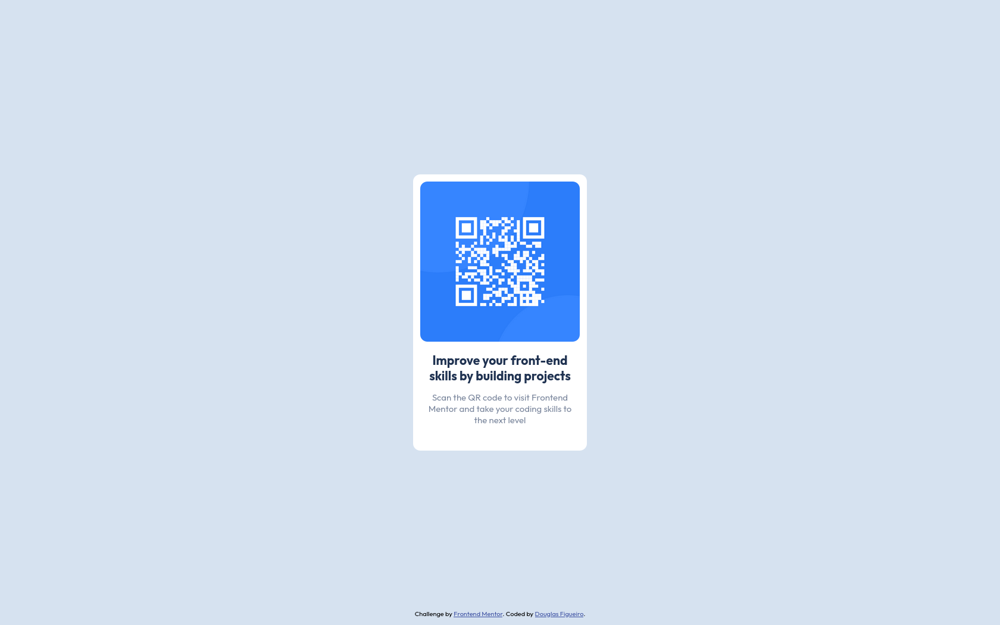

# Frontend Mentor - QR code component solution

This is a solution to the [QR code component challenge on Frontend Mentor](https://www.frontendmentor.io/challenges/qr-code-component-iux_sIO_H). Frontend Mentor challenges help you improve your coding skills by building realistic projects. 

## Table of contents

- [Overview](#overview)
  - [Screenshot](#screenshot)
  - [Links](#links)
- [My process](#my-process)
  - [Built with](#built-with)
  - [What I learned](#what-i-learned)
  - [Continued development](#continued-development)
  - [Useful resources](#useful-resources)
- [Author](#author)

**Note: Delete this note and update the table of contents based on what sections you keep.**

## Overview

### Screenshots
<div display: flex;>
  
  
</div>

### Links

- Solution URL: [QRCode challenge FEM](https://github.com/fig4ro/QRCode)

## My process

### Built with

- Semantic HTML5 markup
- CSS custom properties
- Flexbox

### What I learned

```html
<h1>Some HTML code I'm proud of</h1>
```
```css
/* Variables declaration */
:root
{
    --white: hsl(0, 0%, 100%);
    --lgray: hsl(212, 45%, 89%);
    --gblue: hsl(220, 15%, 55%);
    --dblue: hsl(218, 44%, 22%);
}
/* Another way to positioning an element, translate from previous location */
{
    top: 50%;
    transform: translate(0, -50%);
}
```

### Continued development

Needs to work more with position and learn how to read dimensions, so i can automatically resize and/or reposition an element.

### Useful resources

- [Mozilla docs for dev](https://developer.mozilla.org/en-US/docs/Web/CSS) - This helped me with understanding some functions and layout management. I'd recommend it to anyone still learning this concept.
- [W3Schools docs for CSS](https://www.w3schools.com/cssref/index.php) - This is another resource that i used to see another ways to manage the layout. I'd recommend it to anyone start learning CSS and others.

## Author

- Website - [Douglas Figueiro](https://fig4ro.github.io/)
- Frontend Mentor - [@Douglas](https://www.frontendmentor.io/profile/Douglas)
